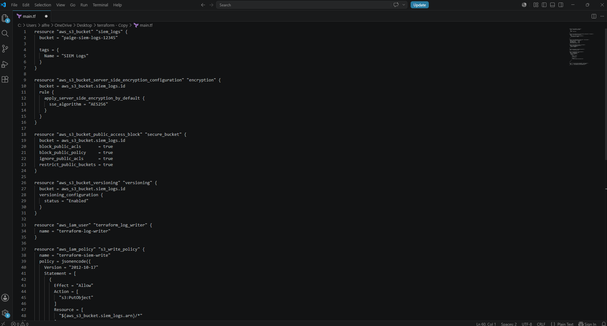
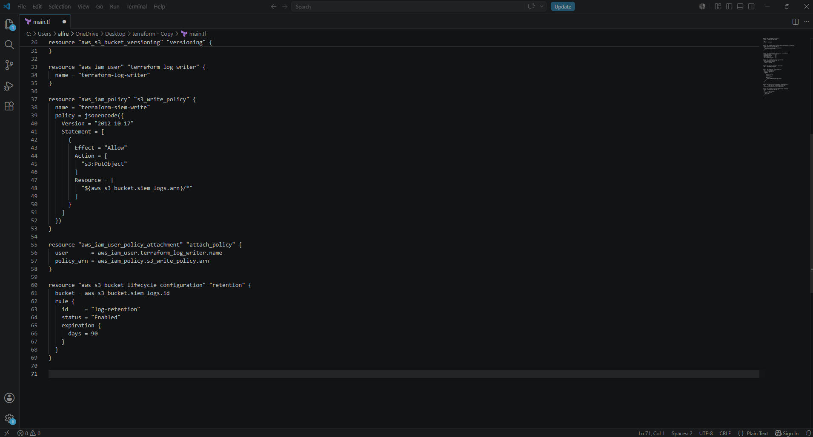
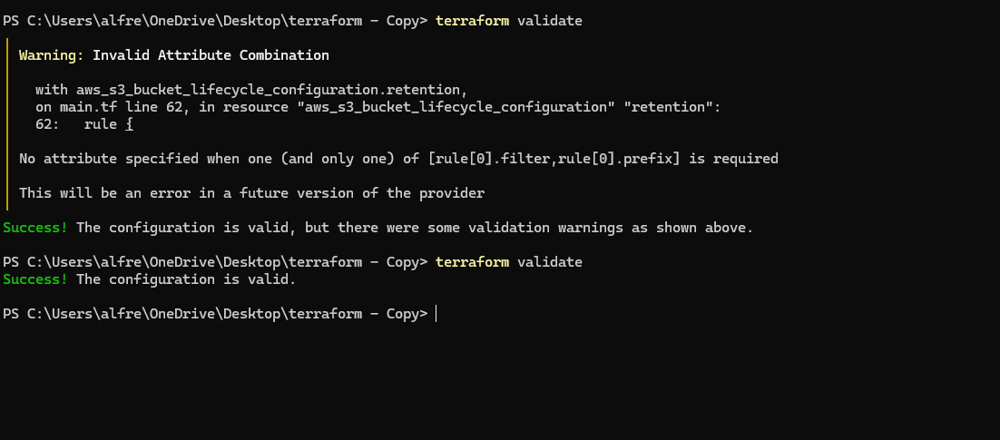
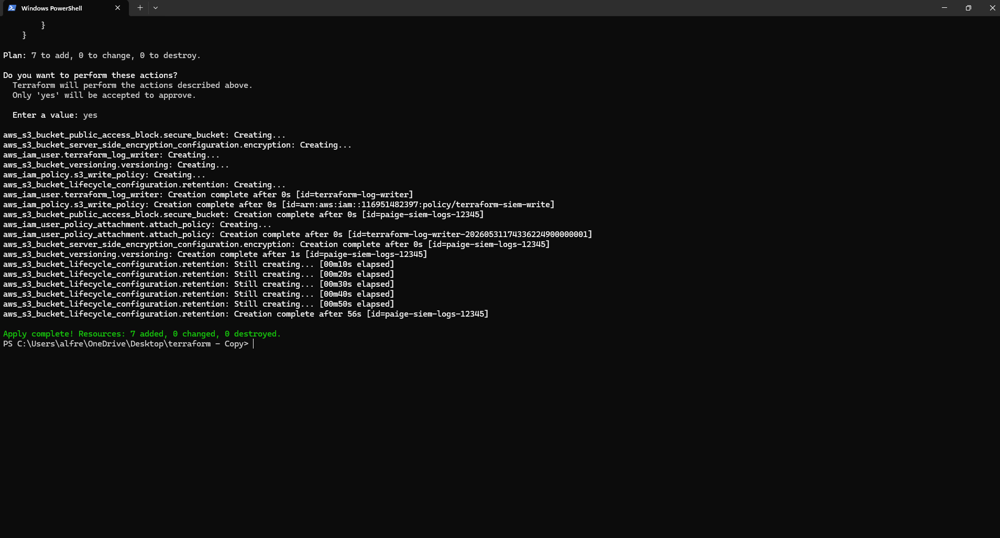
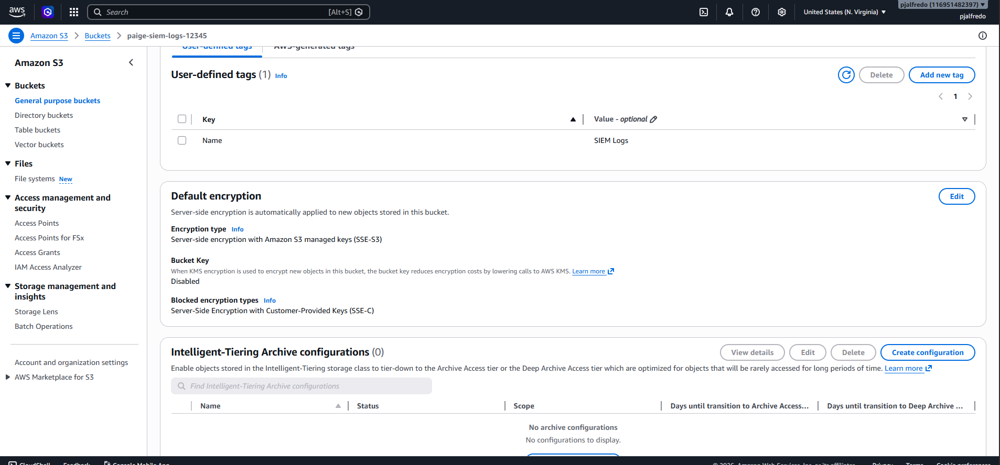
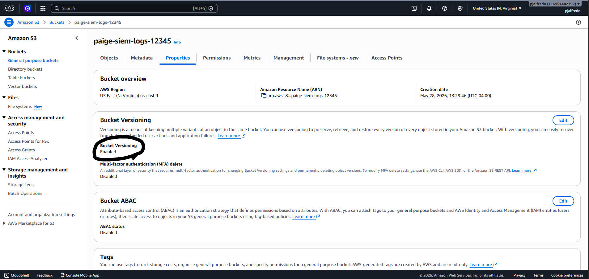
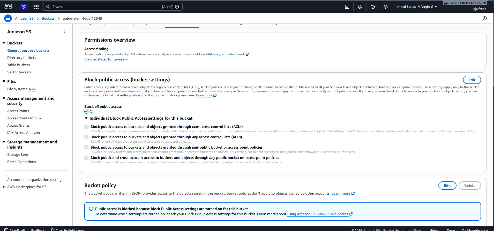
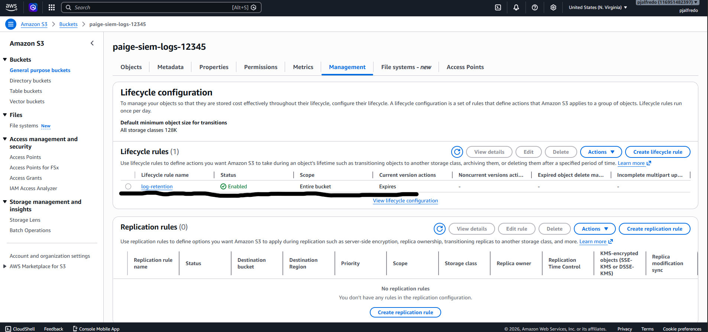
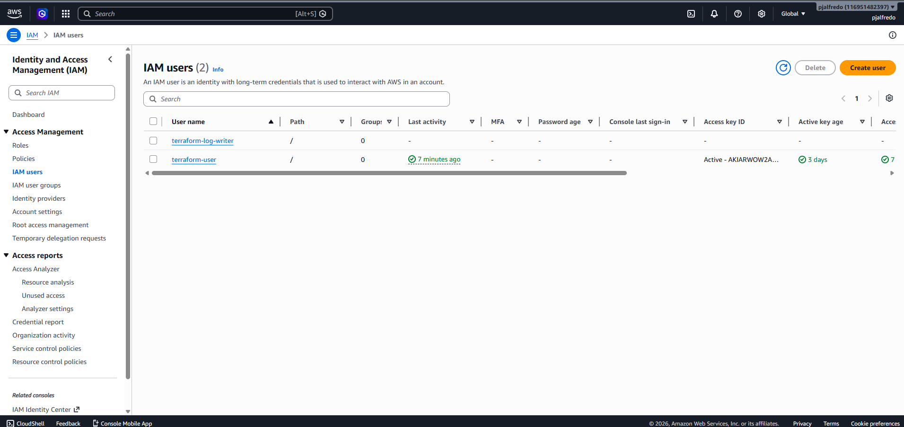
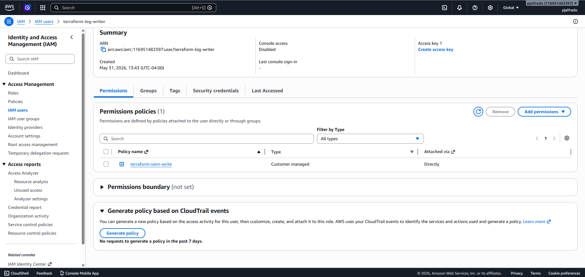

# Terraform AWS SIEM Log Archive , Encryption, IAM & Lifecycle Hardening

This project demonstrates how I used Terraform to provision and secure AWS infrastructure for a SIEM/security log archive workflow.

The project builds on a basic Terraform S3 deployment by adding cloud security controls including encryption, versioning, public access blocking, IAM access control, and lifecycle retention policies.

---

## Technologies Used

- Terraform
- AWS S3
- AWS IAM
- AWS CLI
- PowerShell
- VS Code

---

## Project Purpose

The goal of this project was to use Infrastructure as Code to deploy and secure cloud storage infrastructure for security logs.

Instead of manually creating and configuring resources through the AWS Console, I used Terraform to define the infrastructure in code, validate the configuration, preview the deployment, apply the changes, and verify the resources inside AWS.

This project simulates a real security engineering use case where S3 is used as a centralized archive for SIEM logs, CloudTrail logs, detection datasets, or long-term security data storage.

---

## What This Project Creates

Terraform provisions and configures:

- AWS S3 bucket for SIEM/security log storage
- Server-side encryption using SSE-S3
- S3 bucket versioning
- S3 public access blocking
- S3 lifecycle retention policy
- IAM user for log-writing workflows
- IAM policy granting limited S3 write access
- IAM policy attachment connecting the policy to the user

---

## Terraform Configuration

### main.tf - Part 1



This screenshot shows the first part of the Terraform configuration.

In this section, I defined the AWS S3 bucket and added security controls to harden the bucket.

The S3 bucket is the main storage location for security logs.

The encryption block enables server-side encryption so new objects stored in the bucket are automatically encrypted.

The public access block prevents the bucket from being accidentally exposed to the internet.

The versioning block enables object versioning so previous versions of stored files can be preserved.

---

### main.tf - Part 2



This screenshot shows the second part of the Terraform configuration.

In this section, I defined the IAM and lifecycle components of the project.

The IAM user represents a log writer account that could be used by a system, pipeline, or log shipping tool to send logs into the bucket.

The IAM policy grants permission to upload objects into the S3 bucket.

The policy attachment connects the IAM policy to the IAM user.

The lifecycle configuration applies a 90-day retention policy to objects in the bucket, simulating log retention rules used in security and compliance environments.

---

## Terraform Validation



This screenshot shows the Terraform validation step.

I ran:

```powershell
terraform validate
```

This command checks whether the Terraform configuration is syntactically valid.

Validation confirms that the Terraform files are written correctly and that Terraform can understand the configuration before attempting to deploy anything into AWS.

---

## Terraform Apply



This screenshot shows the Terraform deployment step.

I ran:

```powershell
terraform apply
```

Terraform reviewed the configuration, created the required AWS resources, and applied the infrastructure changes.

This confirms that the infrastructure was successfully deployed using code instead of manually creating each resource through the AWS Console.

---

## AWS Verification

After applying the Terraform configuration, I verified each deployed resource and security control inside AWS.

---

### S3 Encryption Enabled



This screenshot shows that default encryption is enabled on the S3 bucket.

The bucket uses server-side encryption with Amazon S3 managed keys.

This means new objects uploaded to the bucket are automatically encrypted at rest.

Encryption is important for protecting security logs and reducing the risk of exposed sensitive data.

---

### S3 Versioning Enabled



This screenshot shows that bucket versioning is enabled.

Versioning keeps multiple versions of objects stored in the bucket.

This helps protect against accidental deletion or modification of log files.

For security log storage, versioning can support recovery, investigation integrity, and operational resilience.

---

### S3 Public Access Blocked



This screenshot shows that public access is blocked on the S3 bucket.

All public access block settings are enabled.

This prevents the bucket from being accidentally exposed publicly through ACLs or bucket policies.

Blocking public access is a critical AWS security control because misconfigured S3 buckets are a common cloud security risk.

---

### S3 Lifecycle Retention Policy



This screenshot shows the lifecycle rule configured for the S3 bucket.

The lifecycle rule applies a retention policy to objects in the bucket.

In this project, logs are configured to expire after 90 days.

Lifecycle rules are commonly used to manage storage costs, enforce retention policies, and automate log aging in cloud environments.

---

### IAM User Created



This screenshot shows the IAM user created by Terraform.

The IAM user is named:

```text
terraform-log-writer
```

This user represents a service-style account that could be used by a log pipeline or security tool to write logs into the S3 bucket.

Creating this through Terraform demonstrates IAM provisioning through Infrastructure as Code.

---

### IAM Policy Attached



This screenshot shows the IAM policy attached to the Terraform-created IAM user.

The attached policy grants the user permission to upload objects into the S3 bucket.

This demonstrates basic least-privilege access control because the user is only being granted the specific S3 write permission needed for the log archive workflow.

---

## Commands Used

```powershell
terraform validate
terraform plan
terraform apply
```

Additional AWS CLI authentication was configured using:

```powershell
aws configure
```

---

## Key Terraform Concepts Demonstrated

### Provider

The AWS provider allows Terraform to communicate with AWS.

Terraform uses the provider to understand which cloud platform to deploy resources into.

---

### Resource

A resource is something Terraform creates or manages.

In this project, resources include:

- S3 bucket
- S3 encryption configuration
- S3 public access block
- S3 versioning configuration
- IAM user
- IAM policy
- IAM policy attachment
- S3 lifecycle configuration

---

### State

Terraform state tracks what Terraform has created.

The state file allows Terraform to compare the current infrastructure against the desired configuration.

This is how Terraform knows what needs to be added, changed, or destroyed.

---

### Plan

`terraform plan` previews what Terraform intends to do before making changes.

This is important because it allows the engineer to review infrastructure changes before deployment.

---

### Apply

`terraform apply` deploys the infrastructure changes into AWS.

This is the step where Terraform actually creates or updates resources.

---

## Security Controls Implemented

| Control | Purpose |
|---|---|
| S3 Encryption | Protects stored logs at rest |
| Public Access Block | Prevents accidental public exposure |
| Versioning | Preserves previous object versions |
| IAM User | Creates a dedicated access identity |
| IAM Policy | Grants controlled permissions |
| Policy Attachment | Connects permissions to the user |
| Lifecycle Rule | Automates log retention |

---

## What I Learned

Through this project, I learned how to:

- Use Terraform to deploy AWS infrastructure
- Configure S3 bucket security settings with code
- Enable encryption for cloud storage
- Block public access to prevent exposure
- Enable versioning for recovery and integrity
- Create IAM users through Terraform
- Define IAM policies using Terraform
- Attach IAM policies to users
- Configure S3 lifecycle retention rules
- Validate and apply Terraform configurations
- Verify deployed infrastructure inside AWS

---

## Security Engineering Relevance

This project is relevant to cloud security, SIEM engineering, and DevSecOps because secure log storage is a common requirement in enterprise environments.

Security teams often use S3 buckets for:

- SIEM archive storage
- CloudTrail log storage
- Detection engineering datasets
- Long-term investigation data
- Compliance evidence
- Security data lake workflows

Using Terraform allows this infrastructure to be repeatable, auditable, version-controlled, and easier to manage across environments.

---

## Project Summary

This project upgraded a basic Terraform S3 deployment into a more complete cloud security Infrastructure as Code project.

Instead of only creating a bucket, this version adds security hardening, IAM access control, and retention logic.

The final environment demonstrates how Terraform can be used to provision and secure AWS infrastructure for SIEM and security log archive workflows.

---

## Author

Paige Alfred  
GitHub: https://github.com/paigealfred
